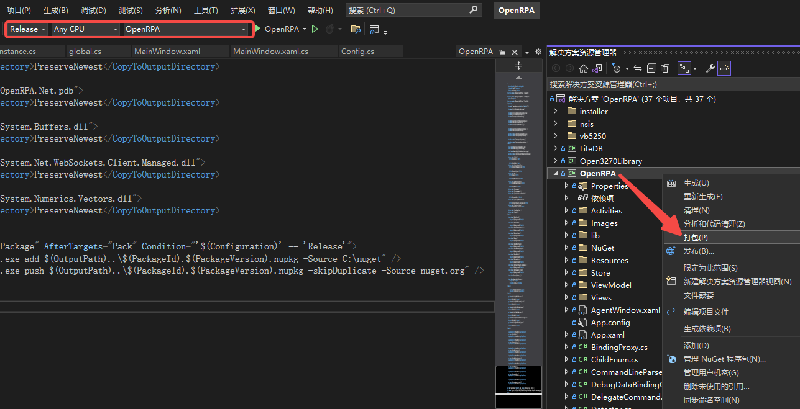
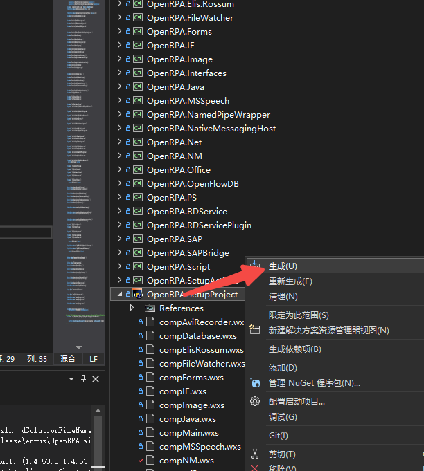

### 配置修改
在OpenRPA中增加配置项`settings.json`
```json
{
  "uniplore_properties": {
    "enable": true,
    "uni_base_url": "",
    "uni_login_path": "/uniplore-va/rpa/openRpaLogin",
    "uni_add_token_request_path": "/uniplore-va/rpa/openRpaAddTokenRequest",
    "uni_get_token_request_path": "/uniplore-va/rpa/openRpaGetTokenRequest"
  }
}
```
- `enable` 是否启用，若为false将使用OpenRPA默认的路径（可直接与OpenFlow进行连接）。默认`true`
- `base_url` 基础地址，若为空、则从wsurl里获取（不含path路径）。默认值：`""`
- `login_path` 浏览器登录地址路径，与base_url拼接生成。默认值：`"/uniplore-va/rpa/openRpaLogin"`
- `add_token_request_path` 添加token接口路径，与base_url拼接生成。默认值：`"/uniplore-va/rpa/openRpaAddTokenRequest"`
- `get_token_request_path` 获取token接口路径，与base_url拼接生成。默认值：`"/uniplore-va/rpa/openRpaGetTokenRequest"`

修改代码：
- `OpenRPA/RobotInstance.cs`
- `OpenRPA.Interfaces/Config.cs`
- `OpenRPA.Interfaces/IWebSocketClient.cs`
- `OpenRPA.Net/SigninMessage.cs`
- `OpenRPA.Net/WebSocketClient.cs`

#### TODO
1. global.openflowconfig
   - 配置返回
   - 打开OpenFlow修改，不使用baseurl
   - 下载文件，不使用baseurl

### 生成msi安装包
1. 安装.net framework v3.5（依赖v2.0与v3.0，安装时会自动下载安装）
2. 安装WiX（[本次安装版本是v3.11.2](https://wixtoolset.org/docs/wix3/)，依赖.net framework v3.5）
3. 重新打开项目，可能需要重新加载`OpenRPA.SetupActions`与`OpenRPA.SetupProject`等项目
4. 将`OpenRPA`切换到`Release`，在解决方案中，右键项目名为`OpenRPA`的子项目、点击`打包`，生成Release文件（在项目根目录下会出现`dist`目录）
   
5. 右键项目名为`OpenRPA.SetupProject`的子项目、点击`生成`，成功后、在该子项目的`bin`目录下会出现`.msi`的安装包
   