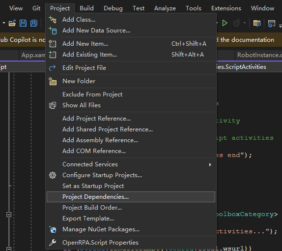
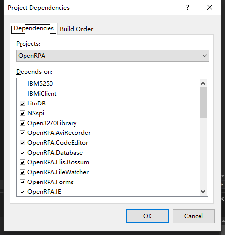

### 本地开发说明
原始文档：[Building-from-source-notes](https://github.com/uniplore/openrpa/wiki/Building-from-source-notes)

#### 1、克隆项目
```shell
git clone https://github.com/uniplore/openrpa.git
```
#### 2、更新子项目
在上一步克隆项目时，也可加上`--recursive`参数，一起将子项目拉下来。
```
git submodule update --init
```

#### 3、安装visual studio社区版
下载并安装Visual Studio 2022 Community edition ( [download here](https://visualstudio.microsoft.com/downloads/) )

#### 4、安装依赖库
1. 打开`openrpa.sln`，忽略首次出现的错误（缺少.net相关开发包）
2. 右键点击`PatchVSCode`，将其设置为启动项目，并运行
3. 等待下载缺少的依赖库（选择覆盖，允许管理员权限）
4. 关闭visual studio并重新打开`openrpa.sln`，删除installer目录下的两个`installer`项目

#### 5、开启模块
- 打开项目依赖窗口



- 设置`OpenRPA`依赖的模块




### 配置修改
在`UniploreOpenRPA`中增加配置项`settings.json`
```json
{
  "noweblogin": false,
  "uniplore_properties": {
    "enable": true,
    "base_url": "",
    "login_path": "/uniplore-va/rpa/openRpaLogin",
    "add_token_request_path": "/uniplore-va/rpa/openRpaAddTokenRequest",
    "get_token_request_path": "/uniplore-va/rpa/openRpaGetTokenRequest",
    "openflow_config_path": "/uniplore-va/rpa/openRpaOpenFlowConfig"
  }
}
```
- `noweblogin` 是否不使用浏览器web登录页面，默认false。当设置为true，并且存在username与password（或unsafepassword），将不会打开浏览器页面进行登录。
- `uniplore_properties.enable` 是否启用，若为false将使用OpenRPA默认的路径（可直接与OpenFlow进行连接）。默认`true`
- `uniplore_properties.base_url` 基础地址，若为空、则从wsurl里获取（不含path路径）。默认值：`""`
- `uniplore_properties.login_path` 浏览器登录地址路径，与base_url拼接生成。默认值：`"/uniplore-va/rpa/openRpaLogin"`
- `uniplore_properties.add_token_request_path` 添加token接口路径，与base_url拼接生成。默认值：`"/uniplore-va/rpa/openRpaAddTokenRequest"`
- `uniplore_properties.get_token_request_path` 获取token接口路径，与base_url拼接生成。默认值：`"/uniplore-va/rpa/openRpaGetTokenRequest"`
- `uniplore_properties.openflow_config_path` 获取配置的接口路径，与base_url拼接生成。默认值：`"/uniplore-va/rpa/openRpaOpenFlowConfig"`


#### TODO
1. global.openflowconfig
   - 打开OpenFlow修改，不使用baseurl
   - 下载文件，不使用baseurl

### 生成msi安装包
1. 安装.net framework v3.5（依赖v2.0与v3.0，安装时会自动下载安装）
2. 安装WiX（[本次安装版本是v3.11.2](https://wixtoolset.org/docs/wix3/)，依赖.net framework v3.5）
3. 重新打开项目，可能需要重新加载`OpenRPA.SetupActions`与`OpenRPA.SetupProject`等项目
4. 将`OpenRPA`切换到`Release`，在解决方案中，右键项目名为`OpenRPA`的子项目、点击`打包`，生成Release文件（在项目根目录下会出现`dist`目录）
   
5. 右键项目名为`OpenRPA.SetupProject`的子项目、点击`生成`，成功后、在该子项目的`bin`目录下会出现`.msi`的安装包
   